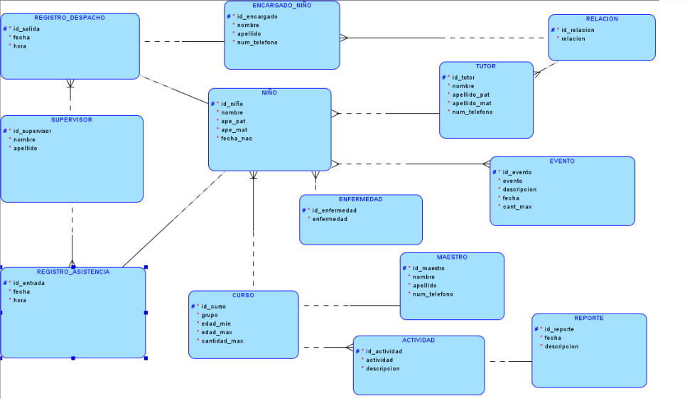

# FusionSoft

## Descripción
Este sistema web integral para el registro y gestión de niños en una iglesia facilita el proceso 
de inscripción, organiza la participación de los niños en actividades y eventos según su edad y
Documento de Especificación de Requisitos del Proyecto
Sistema web de Control y Registro de niños
5
horarios, permite a los padres registrar a sus hijos de manera sencilla proporcionando 
información básica y seguridad de los niños.
## Integrantes del Equipo
| Nombre                                | Rol                                   |
|---------------------------------------|---------------------------------------|
| Willy Jhonatan Condori Esteban        | Coach                                 |
| Maria del Carmen Rivera Mamani        | Front End  
| Ahmed Kael Najar Vargas               | Back End
| Eva Laura Quispe Murga                | Analista de Calidad de Software
## Herramientas de Desarrollo

### PHP
PHP es un lenguaje de programación de código abierto especialmente diseñado para el desarrollo web. Permite crear aplicaciones dinámicas y es ampliamente utilizado en el backend.

### HTML
HTML (HyperText Markup Language) es el lenguaje estándar para crear páginas web. Proporciona la estructura básica de los sitios web y se complementa con CSS y JavaScript para mejorar la presentación y funcionalidad.

## Gestor BD

### MySQL
MySQL es un sistema de gestión de bases de datos relacional de código abierto. Es conocido por su rapidez, confiabilidad y facilidad de uso, siendo una opción popular para aplicaciones web.

## Diagrama de BD
